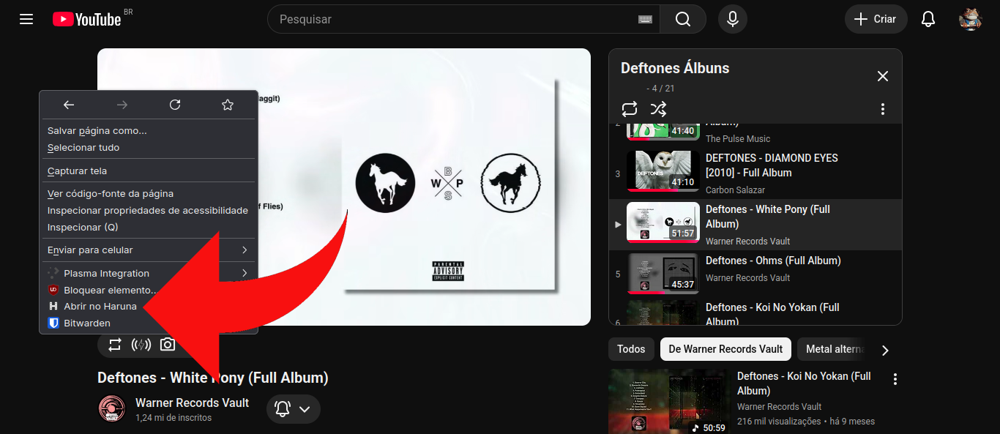
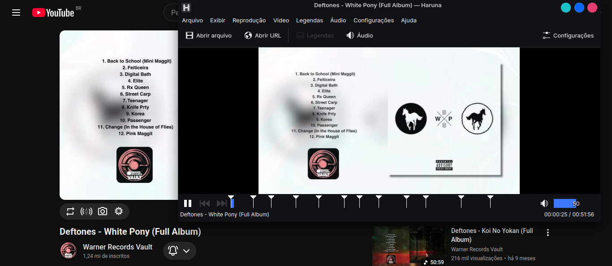

# Haruna Firefox Opener 🎬🦊

[](https://addons.mozilla.org/pt-BR/firefox/addon/abrir-no-haruna/)

This project consists of a Firefox extension and a Linux native messaging host that allows you to right-click any video link (YouTube, Vimeo, etc.) and open it directly in the **Haruna Media Player** (RPM version).

> 🇧🇷 **Nota:** Esta extensão envia links do navegador diretamente para o player Haruna no Fedora.

<p align="center">
  
  
</p>

---

## 🚀 Instalação / Installation (Linux/Fedora)

Como a extensão interage com o sistema operacional, você precisa instalar o script intermediário (Native Host) manualmente na sua máquina além de instalar a extensão no Firefox.

### 1. Preparar as pastas locais / Prepare local directories
Abra o terminal e crie as pastas necessárias caso elas não existam:
```bash
mkdir -p ~/.mozilla/native-messaging-hosts
mkdir -p ~/.local/bin
```

### 2. Baixar o Script Python / Download the Python Script
Crie o arquivo `haruna_wrapper.py` em `~/.local/bin/` com o código contido neste repositório e torne-o executável:
```bash
chmod +x ~/.local/bin/haruna_wrapper.py
```

### 3. Configurar o Manifesto Nativo / Configure Native Manifest
Crie o arquivo `org.custom.haruna.json` dentro da pasta `~/.mozilla/native-messaging-hosts/`.

⚠️ **IMPORTANTE / IMPORTANT:**
Abra o arquivo e substitua `/home/SEU_USUARIO/` pelo caminho real da sua pasta Home (ex: `/home/lu15/`).

```json
{
  "name": "org.custom.haruna",
  "description": "Native messaging host para abrir links no Haruna",
  "path": "/home/YOUR_USER/.local/bin/haruna_wrapper.py",
  "type": "stdio",
  "allowed_extensions": [
    "haruna-opener@lu15-f3-dev.org"
  ]
}
```

---

## 🚀 Instalação Automatizada (Recomendado)

Abra o terminal do seu Fedora/Linux e rode o comando abaixo para instalar todos os arquivos locais necessários de forma automática:

```bash
curl -sSL "https://raw.githubusercontent.com/Lu15-F3/haruna-firefox-opener/main/install.sh" | bash
```

Esse comando vai criar os diretórios necessários, baixar o script de comunicação nativa e configurar os caminhos corretos para o seu usuário.

Depois disso, basta instalar a extensão na loja do Firefox e ativar a permissão para janelas privativas (modo anônimo), caso deseje!

---

## 📂 Arquivos deste Repositório / Repository Files

Para fins de backup e transparência com a comunidade, este repositório contém:

* **haruna_wrapper.py** -> O script Python que roda no seu Linux.
* **org.custom.haruna.json** -> O manifesto que você coloca na pasta oculta do Mozilla.
* **manifest.json** e **background.js** -> O código-fonte da extensão do navegador.

### 📦 Notas sobre Flatpak / Snap
Esta extensão foi projetada para as versões nativas (RPM/DEB) do Firefox e do Haruna. Se você utiliza as versões em Flatpak ou Snap, os caminhos das pastas mudam devido ao isolamento do sistema:

* **Firefox em Flatpak:** O arquivo `org.custom.haruna.json` deve ser movido para:
  `~/.var/app/org.mozilla.firefox/.mozilla/native-messaging-hosts/`
  
* **Haruna em Flatpak:** Pode ser necessário editar o script `haruna_wrapper.py` para chamar o player usando o comando `flatpak run org.kde.haruna` em vez de apenas `haruna`.
